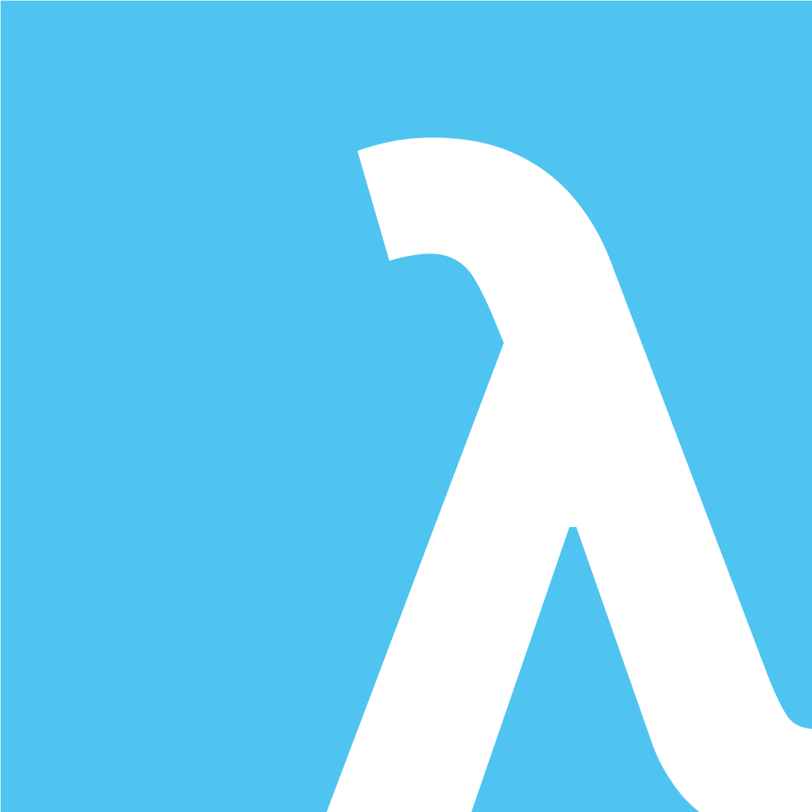

* MSS


 

* UQCS




---

# Intro Example

wtf?

1. Option A

~~~python
def maskedFunction(n: int) -> int:

    x = 0
    i = 0
    y = 1
    k = 0
    while i != n:
        x,y,k = y, x + k + y, k + y + y
        i += 1

    return x
~~~

2. Option B

~~~python
def maskedFunction(n: int) -> int:

    x = 0
    i = 0
    y = 1
    k = 0
    while i != n:
        x,y,k = y, x + k + y, y + y
        i += 1

    return x
~~~

---

# Intro Example

Which is which?

1. Option A

~~~python
def maskedFunction(n: int) -> int:

    x = 0
    i = 0
    y = 1
    k = 0
    while i != n:
        x,y,k = y, x + k + y, k + y + y
        i += 1

    return x
~~~

2. Option B

~~~python
def maskedFunction(n: int) -> int:

    x = 0
    i = 0
    y = 1
    k = 0
    while i != n:
        x,y,k = y, x + k + y, y + y
        i += 1

    return x
~~~

---

# History Class

|  |  |
|--------|-------------|
|- Tony Hoare |  |
|- Edsger Dijkstra |  |

Other notable mentions:
- Bertrand Russell
- Kurt Godel
- Alan Turing

---

## Tony Hoare

- Invented the null pointer (million dollar mistake)
- Quicksort
- Hoare logic and Hoare triples

{P} C {Q}


* P: pre-condition
* C: command
* Q: post-condition


- Effectively says: when the pre-condition (P) is met, then the command (C) will output something within the post-conditoin (Q)
- Partial or total correctness? (thanks Godel... ://)

---

## Tony Hoare

{P} C {Q}

* Command is any "program" (program, function, line of code?)

~~~c
/* swaps pointers for `a` and `b`
 * Requires: *a,*b are pointers with *a = *a and *b = *b
 * Ensures: *a,*b are pointers with *a = old(*b) and *b = old(*a)
 */
void swap(void** a, void** b) {

    void* bTmp = *b;
    *b = *a;
    *a = bTmp;
}
~~~

* Any line in the program can be considered a "program", and can be reasoned about. i.e.

~~~c
{P} `*b = *a` {Q}
~~~
* But what is P and Q?

---

## Dijkstra

* Shortest path
* Concurrency and threading (we have threads thanks to him!)
* Weakest precondition logic
    * Lets us reason about programs systematically


* "Programs" chained together gives a chain of implications
* Function on the whole should have P ==> Q, built by individual

{P} C {Q}


* We can reason "down" (strongest post-condition); or
* Can reason "upwards" (weakest pre-condition)


Weird (but important) consideration:
* A ==> B is logically !A || B
    * false implies anything (any input allowed)
    * anything implies true (non-sensical)

---

# Dijkstra


~~~c
/* swaps pointers for `a` and `b`
 * Requires: *a,*b are pointers with *a = old(*a) and *b = old(*b)
 * Ensures: *a,*b are pointers with *a = old(*b) and *b = old(*a)
 */
void swap(void** a, void** b) {

    
    void* tmp = *a;
    
    *a = *b;
    
    *b = tmp;
    
}
~~~

---

# Dijkstra


~~~c
/* swaps pointers for `a` and `b`
 * Requires: *a,*b are pointers with *a = old(*a) and *b = old(*b)
 * Ensures: *a,*b are pointers with *a = old(*b) and *b = old(*a)
 */
void swap(void** a, void** b) {

    
    void* tmp = *a;
    
    *a = *b;
    
    *b = tmp;
    // [3] *a == old(*b) && *b == old(*a)
}
~~~

* we see that the post-condition implies line [3]

---

# Dijkstra


~~~c
/* swaps pointers for `a` and `b`
 * Requires: *a,*b are pointers with *a = old(*a) and *b = old(*b)
 * Ensures: *a,*b are pointers with *a = old(*b) and *b = old(*a)
 */
void swap(void** a, void** b) {

    
    void* tmp = *a;
    
    *a = *b;
    // [2] *a == old(*b) && tmp == old(*a)
    *b = tmp;
    // [3] *a == old(*b) && *b == old(*a)
}
~~~

* we see that the post-condition implies line [3]
* this, with the substitution of `*b = tmp`, implies [2]

---

# Dijkstra


~~~c
/* swaps pointers for `a` and `b`
 * Requires: *a,*b are pointers with *a = old(*a) and *b = old(*b)
 * Ensures: *a,*b are pointers with *a = old(*b) and *b = old(*a)
 */
void swap(void** a, void** b) {

    
    void* tmp = *a;
    // [1] *b == old(*b) && tmp == old(*a)
    *a = *b;
    // [2] *a == old(*b) && tmp == old(*a)
    *b = tmp;
    // [3] *a == old(*b) && *b == old(*a)
}
~~~

* we see that the post-condition implies line [3]
* by the same process, we have that [2] ==> [1]

---

# Dijkstra

* put it all together:

~~~c
/* swaps pointers for `a` and `b`
 * Requires: *a,*b are pointers with *a = old(*a) and *b = old(*b)
 * Ensures: *a,*b are pointers with *a = old(*b) and *b = old(*a)
 */
void swap(void** a, void** b) {

    // [0] *b == old(*b) && *a == old(*a)
    void* tmp = *a;
    // [1] *b == old(*b) && tmp == old(*a)
    *a = *b;
    // [2] *a == old(*b) && tmp == old(*a)
    *b = tmp;
    // [3] *a == old(*b) && *b == old(*a)
}
~~~

* we see that the post-condition implies line [3]
* each line [i] implies [i-1]
* line [0] implies the pre-condition

* have proved that this program is correct!

---

# Things We Concern Ourselves With

* reasoning about loops?
    * does our program halt?
* calling functions? recursion? 
    * halting again?
* pointers? arrays?
* objects?

---

## General Reasoning

* substitution
    * when setting a variable, simply replace all instances of that variable in your predicate with the 'new' value

~~~python
# x >= -3
# 3 + x >= 0
x = 3 + x
# x >= 0
~~~

* if statements
    * if A then B else C gives `A ==> B && !A ==> C`

~~~python
# (A ==> B) && (!A ==> C)
if A:
    B()
else:
    C()
~~~

* function calls
    * Pre-condition (with input parameter) && output space implies assignment value
        * don't worry about them for this talk 

* loops...

---

## Loops

* invariants:
    * invariant: predicate which holds at start and end of a loop
    * need to figure out what stays the same (non-trivial)
* halting conditions
    * how do we know a loop finishes?

* what we know about a loop:
    1. at start of loop: guard must be true, and invariant must hold
    2. at end of loop: the invariants hold (guard might be false)
    3. after the loop: the negation of the guard holds, and the invariants hold

~~~python
while G:
    # { G && J } 
    pass # something happens

    # { J }
# { !G && J }
~~~

* Hard to reason about loops (coming up with invariants)
    * Ongoing research (UQ! ANU!)

* Using a couple techniques, it's not impossible...

---

## Loop Design Techniques

* Loop invariants are hard to come up with...
    * Not currently known how to automate (UQ research!)
    * But some tactics can help:

1. Invariant and negation of guard
    * Given a postcondition (e.g. A && B), use it to set an invariant (A) and the guard (!B)

2. Wishing for a variable
    * (create) a variable which calculates something, making reasoning easier

3. Replacing a constant in the postcondition
    * Post-condition has a constant, which holds through the loop with the variable

4. Using the postcondition itself
    * Simply set the post-condition as an invariant

5. Weakening the postcondition
    * Same as above, but make weaker (can weaken as we reason up!)

---


## Strengthening

* due to this weird property I mentioned earlier, we can do some funky things:

    * A ==> B is logically !A || B
        * false implies anything (any input allowed)
        * anything implies true (non-sensical)

By WP backward reasoning, need post-condition to imply the pre-condition
* if we restrict our input space, then it will still imply the post-condition

~~~python
# x == 51
# 50 <= x <= 50
# 0 <= x <= 100 
~~~
* for above:
    * reasoning backwards: we restrict the input space further as we move upwards
    * reasoning forwards: each line implies the next

---    

# Creating Fibonacci Sequence Squared

**Scenario**
* Our boss wants the Fibonacci sequence, but wants it squared because the normal one is boring
* BUT, they also don't like multiplication because their primary school teacher made them memorise too many times tables
    * must only use addition
* if we get even one term wrong, we're fired. It's very important to them that they can get the nth Fibonacci term squared

* how in the heck...


---

# Creating Fibonacci Sequence Squared

**Specification**
* given a natural number (including 0)
* want the nth Fibonacci number, squared

**Formal Specification**
~~~python
def squareFib(n: int) -> int:
    """
    requires: 0 <= n
    ensures: (return) == Fib(n)*Fib(n)
    """
    raise NotImplementedError
~~~

* assume we can verify what the nth Fibonacci number is
    * independent of our implementation (doesn't follow multiplication constraint)


* we know what we start with, and what we want at the end... fill in the gaps!

---

# Creating Fibonacci Sequence Squared

* we can reason about a skeleton structure
    * know we'll need a loop (iterator i), and a return value (`value`)
    * basic loop invariants 

~~~python
def squareFib(n: int) -> int:
    """
    requires: 0 <= n
    ensures: (return) == Fib(n)*Fib(n)
    """
    x = 0
    i = 0

    while i != n:
        # invariant 0 <= i < = n
        # invariant x == Fib(i) * Fib(i)

        i = i + 1
~~~

---

# Creating Fibonacci Sequence Squared

* focus on the loop - we know the invariants must hold at start and end of each iteration, and guard is true

~~~python
while i != n:
    # invariant 0 <= i <= n
    # invariant x == Fib(i) * Fib(i)

    # { 0 <= i <= n && i != n && x == Fib(i) * Fib(i) }

    # ... ?

    # { 0 <= i <= n && i != n && x == Fib(i+1) * Fib(i+1) }
    # { 0 <= i < n && x == Fib(i+1) * Fib(i+1) }
    # { -1 <= i <= n - 1 && x == Fib(i+1) * Fib(i+1) }
    # { 0 <= i+1 <= n && x == Fib(i+1) * Fib(i+1) }
    i = i + 1
    # { 0 <= i <= n && x == Fib(i) * Fib(i) }
~~~

* need our reasoning to imply the invariant...:
`x == Fib(i+1) * Fib(i+1) ==> x == Fib(i) * Fib(i)`

---

# Creating Fibonacci Sequence Squared

* can "wish" for a variable to fill in the gap! We want a variable "y" where `y == Fib(i+1) * Fib(i+1)`
    * add invariant
* so we need `x` to be `y`

~~~python
while i != n:
    # invariant 0 <= i <= n
    # invariant x == Fib(i) * Fib(i)
    # invariant y == Fib(i+1) * Fib(i+1)

    # { 0 <= i <= n && i != n && x == Fib(i) * Fib(i) }
    
    # ... ?

    # { 0 <= i <= n && i != n && y == Fib(i+1) * Fib(i+1) }
    x = y

    # { 0 <= i <= n && i != n && x == Fib(i+1) * Fib(i+1) }
    # { 0 <= i < n && x == Fib(i+1) * Fib(i+1) }
    # { -1 <= i <= n - 1 && x == Fib(i+1) * Fib(i+1) }
    # { 0 <= i+1 <= n && x == Fib(i+1) * Fib(i+1) }
    i = i + 1
    # { 0 <= i <= n && x == Fib(i) * Fib(i) }
~~~

---
# Creating Fibonacci Sequence Squared

* now need to reason about the behaviour of y
* almost got there... similar situation to before

~~~python
while i != n:
    # invariant 0 <= i <= n
    # invariant x == Fib(i) * Fib(i)
    # invariant y == Fib(i+1) * Fib(i+1)

    # { y == Fib(i+1) * Fib(i+1) }

    # ... ?

    # { y == x + y + 2 * Fib(i) * Fib(i+1) }
    # { y == Fib(i) * Fib(i) + Fib(i+1) * Fib(i+1) + 2 * Fib(i) * Fib(i+1) }
    # { y == Fib(i) * Fib(i) + 2 * Fib(i) * Fib(i+1) + Fib(i+1) * Fib(i+1) }
    # { y == (Fib(i) + Fib(i+1)) * (Fib(i) + Fib(i+1)) }
    # { y == Fib(i+2) * Fib(i+2) }
    i = i + 1
    # { y == Fib(i+1) * Fib(i+1) }
~~~

* need:`y == x + y + (2 * Fib(i) * Fib(i+1))` ==> `y == Fib(i+1) * Fib(i+1)`


---
# Creating Fibonacci Sequence Squared

* wish for k, so add an invariant saying it stays that value!
    * invariant `k == 2 * Fib(i) * Fib(i+1)`
* program becomes:

~~~python
while i != n:
    # invariant 0 <= i <= n
    # invariant x == Fib(i) * Fib(i)
    # invariant y == Fib(i+1) * Fib(i+1)
    # invariant k == 2 * Fib(i) * Fib(i+1)

    # { y == Fib(i+1) * Fib(i+1) }

    # { y == Fib(i+1) * Fib(i+1) }
    # { x + y + k == x + k +  Fib(i) * Fib(i+1) }
    # { x + y + k == x + k + Fib(i+1)*Fib(i+1) }
    # { x + y + k == x + 2 * Fib(i) * Fib(i+1) + y }

    y = x + y + k

    # { y == x + y + 2 * Fib(i) * Fib(i+1) }
    # { y == Fib(i) * Fib(i) + Fib(i+1) * Fib(i+1) + 2 * Fib(i) * Fib(i+1) }
    # { y == Fib(i) * Fib(i) + 2 * Fib(i) * Fib(i+1) + Fib(i+1) * Fib(i+1) }
    # { y == (Fib(i) + Fib(i+1)) * (Fib(i) + Fib(i+1)) }
    # { y == Fib(i+2) * Fib(i+2) }
    i = i + 1
    # { y == Fib(i+1) * Fib(i+1) }
~~~
* exactly what we wanted! now, about that k...

---

# Creating Fibonacci Sequence Squared

* we wished for k, so now we must reason about it as well!

~~~python
while i != n:
    # invariant 0 <= i <= n
    # invariant x == Fib(i) * Fib(i)
    # invariant y == Fib(i+1) * Fib(i+1)
    # invariant k == 2 * Fib(i) * Fib(i+1)

    # { k == 2 * Fib(i) * Fib(i+1) }

    # ... ?

    # { k == 2 * Fib(i+1) * Fib(i) + 2 * y } 
    # { k == 2 * Fib(i+1) * Fib(i) + 2 * Fib(i+1) * Fib(i+1) }
    # { k == 2 * Fib(i+1) * (Fib(i) + Fib(i+1)) }
    # { k == 2 * Fib(i+1) * Fib(i+2) }
    i = i + 1
    # { k == 2 * Fib(i) * Fib(i+1) } 
~~~

---
# Creating Fibonacci Sequence Squared

* knowing what k must be:

~~~python
while i != n:
    # invariant 0 <= i <= n
    # invariant x == Fib(i) * Fib(i)
    # invariant y == Fib(i+1) * Fib(i+1)
    # invariant k == 2 * Fib(i) * Fib(i+1)

    # { k == 2 * Fib(i) * Fib(i+1) }

    # { k == 2 * Fib(i+1) * Fib(i) }
    # { k + y + y == 2 * Fib(i+1) * Fib(i) + 2 * y }
    k = k + y + y
    # { k == 2 * Fib(i+1) * Fib(i) + 2 * y } NOTE: can't use multiplication by spec
    # { k == 2 * Fib(i+1) * Fib(i) + 2 * Fib(i+1) * Fib(i+1) }
    # { k == 2 * Fib(i+1) * (Fib(i) + Fib(i+1)) }
    # { k == 2 * Fib(i+1) * Fib(i+2) }
    i = i + 1
    # { k == 2 * Fib(i) * Fib(i+1) }  
~~~
* this final implication was reached without making any wishes or tricks, so we're done!

---
# Creating Fibonacci Sequence Squared

* to summarise, individually, we found that our variables had to be set:

```text
x = y
y = x + y + k
k = k + y + y
```

* upon setting all these, our end-invariants implied the guard and start invariants


---
# Creating Fibonacci Sequence Squared

* finally, we have:

~~~python
while i != n:
    # invariant 0 <= i <= n
    # invariant x == Fib(i) * Fib(i)
    # invariant y == Fib(i+1) * Fib(i+1)
    # invariant k == 2 * Fib(i) * Fib(i+1)

    # { 0 <= i <= n && i != n && x == Fib(i) * Fib(i) && y == Fib(i+1) * Fib(i+1) && k == 2 * Fib(i) * Fib(i+1) }

    # ... [long proof]

    # { 0 <= i < n && i != n && y == Fib(i+1) * Fib(i+1) && x + y + k == Fib(i+1) * Fib(i+1) && k + y + y == 2 * Fib(i) * Fib(i+1) }
    # { 0 <= i+1 <= n && y == Fib(i+1) * Fib(i+1) && x + y + k == Fib(i+2) * Fib(i+2) && k + y + y == 2 * Fib(i+1) * Fib(i+2) }
    x, y, k = y, x + y + k, k + y + y
    # { 0 <= i+1 <= n && x == Fib(i+1) * Fib(i+1) && y == Fib(i+2) * Fib(i+2) && k == 2 * Fib(i+1) * Fib(i+2) } 
    i = i + 1
    # { 0 <= i <= n && x == Fib(i) * Fib(i) && y == Fib(i+1) * Fib(i+1) && k == 2 * Fib(i) * Fib(i+1) }  
~~~

---

# Solution

* which option was right? The first one, A!
* better yet, we _proved_ that we will correctly generate what's wanted

~~~python
def squareFib(n: int) -> int:
    """
    requires: 0 <= n
    ensures: (return) == Fib(n)*Fib(n)
    """

    x = 0
    i = 0
    y = 1
    k = 0
    while i != n:
        x,y,k = y, x + k + y, k + y + y
        i += 1

    return x
~~~

* this program is correct
* this program was generated without "us" deciding how to write code
* fast! (linear time)


* question: how were the initial values calculated?

---

# Demo!

~~~python
def squareFib(n: int) -> int:
    """
    requires: 0 <= n
    ensures: (return) == Fib(n)*Fib(n)
    """

    x,i,y,k = 0,0,1,0
    
    while i != n:
        x,y,k = y, x + k + y, k + y + y
        i += 1

    return x
~~~

```terminal8
python ./square_fib.py
```
the Fibonacci sequence for reference:

0 1 2 3 4 5 6 7  8  9  10 ...

0 1 1 2 3 5 8 13 21 34 55 ...

---


# Why and Who

**What?**
* security of programs
    * verification of programs
    * identifying bugs
    * symbolic execution
* code generation?
* constrained environments

**Who?**
* ~~CSIRO~~ (rip)
    * seL4
* NASA
    * Mars rover
* Tesla
    * Autopilot
* Google
    * Vulnerability research
* Microsoft
    * Dafny
* Defence

---

# References and Further Reading

- CSSE3100 - "Reasoning About Programs" (good course)
    - by extension, Graeme Smith and Kirsten Winter
- "Program Proofs" by K. Rustan, M. Leino
- "Communicating Sequential Processes" by Tony Hoare

---

# Yay!